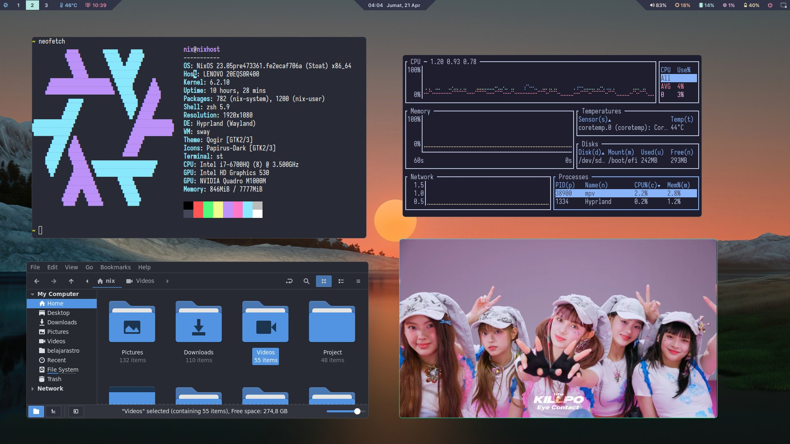

# Thinkpad P50 Flake



This is my system configuration for Thinkpad P50.

> If you create use this repo, make sure to change everything inside `hardware-configuratin.nix` as your system created. Because if not, you will mess up your system, and maybe will not boot.

## How to create system configuration for flakes? 

1. Create a directory called `~/.dotfiles` then cd into this folder.
1. Copy `/etc/nixos/configuration.nix` and `/etc/nixos/hardware-configuration.nix` in to `.dotfiles` folder we created before.
1. Create a file called `flake.nix` then define the system configuration in it.

```nix
{
  description = "Thinkpad P50 flake";

  inputs = {
    # I use nixos unstable channel
    nixpkgs.url = "nixpkgs/nixos-unstable";
  };

  outputs = { self,nixpkgs, ...}: 
  let 
    lib = nixpkgs.lib;
  in
    {
    nixosConfigurations = {
    # nixhost is my hostname, make sure you change it.
      nixhost = lib.nixosSystem {
        system = "x86_64-linux";
        modules = [ ./configuration.nix ];
      };
    };
  };
}

```

## How to create home manager config for flakes?

1. Make sure you have install home manager first, choose [Stand alone installation](https://nix-community.github.io/home-manager/index.html#sec-install-standalone)
1. Once you setup home-manager, copy `~/.config/home-manager/home.nix` into `~/.dotfiles` folder that just created
1. Edit the `flake.nix` file like this:

```nix
{
  description = "Thinkpad P50 flake";

  inputs = {
    # I use nixos unstable channel
    nixpkgs.url = "nixpkgs/nixos-unstable";
    # I want to use branch master, which is default in home-manager, which will profide the latest app or the unstable version app
    home-manager.url = "github:nix-community/home-manager/master";
    home-manager.inputs.nixpkgs.follows = "nixpkgs";
  };

  outputs = { self,nixpkgs, home-manager, ...}: 
  let 
    lib = nixpkgs.lib;
    system = "x86_64-linux";
    pkgs = nixpkgs.legacyPackages.${system};
  in {
    nixosConfigurations = {
    # nixhost is my hostname
      nixhost = lib.nixosSystem {
        inherit system; 
        modules = [ ./configuration.nix ];
      };
    };
    homeConfigurations = {
    # nix is my user name, make sure to change this
      nix = home-manager.lib.homeManagerConfiguration {
        inherit pkgs; 
        modules = [ ./home/home.nix ];
      };
    };

  };
}

```

## How to use this flake repo?

> Make sure to istall Install home manager fist

1. Clone it.
1. Change the `hardware-configuration.nix` as your system created.
1. Rebuild the system with flake command : `sudo nixos-rebuild switch --flake .`
1. Rebuild the home-manager : `home-manager switch --flake .`
1. Wait till it finish.
1. See the generations `nix-env --list-generations --profile /nix/var/nix/profiles/system`

> If you got error when build home-manager, run this : `sudo chown nix flake.lock` and `sudo chgrp users flake.lock`.

## How to update?

Now your system configuration is setup by flakes.

Every time you want to update, first go to this `.dotfiles` folder then update the system with this command:
1. `nix flake update`
1. `sudo nixos-rebuild switch --flake .`

## Tips

Now every time you want to edit the system config or add package into home-manager, just go to `~/.dotfiles` folder then edit the files.

> Never touch the `hardware-configuration.nix` files if you don't know what to do.


Big thanks to : [LibrePhoenix](https://www.youtube.com/watch?v=ACybVzRvDhs) for creating the nixos flake content for novious like me.
