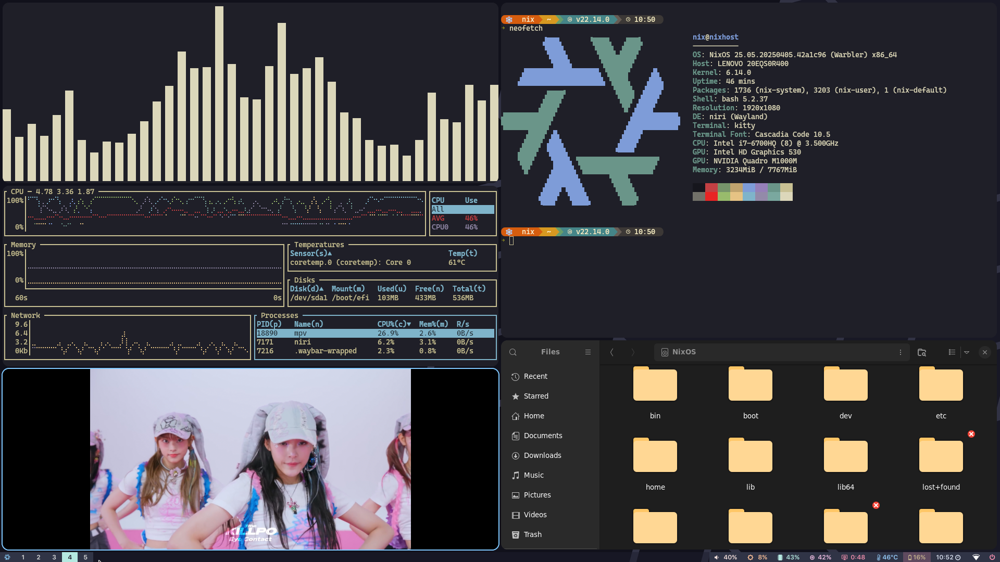

# Nixos Configs



## current defaults
 - WM: Niri
 - Bar: Waybar
 - Greeter: ly
 - Text Editor: Nvim
 - Browser: Firefox
 - File manager: Nautilus

# Other Configs

  All other program configs are found in the /nix/.config folder 

> This repo do not use **nixos home-manager**, because create a config app that is sometimes painful. So let's manually copy those config folder to the home.

# Things you should change

## hardware-configuration

> If you create use this repo, make sure to change everything inside `hardware-configuratin.nix` as your system created. Copy your own hardware-configuration file. Because if not, you will mess up your system, and maybe will not boot.

### Check configs in /modules/user.nix

consider to change username and hostname, I use this:

```
username: nix
hostname: nixhost
```

# Perform rebuild using this flake

```
cd to this flake folder, then run:

sudo nixos-rebuild switch --flake .
```

To perform nixos-rebuild system add `--flakes` command and add `.` (dot) at the end of line. `sudo nixos-rebuild switch --flake .`

# Perform update

1. `nix flake update`
1. `sudo nixos-rebuild switch --flake .`
