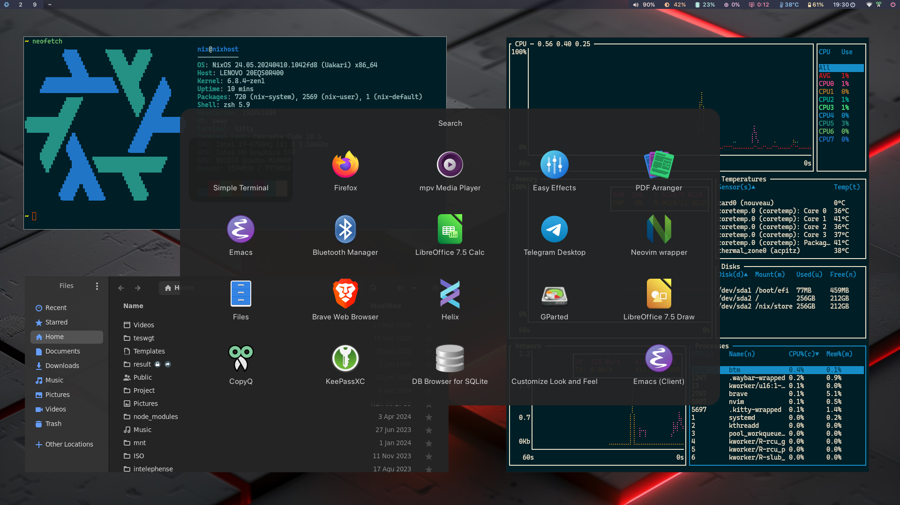
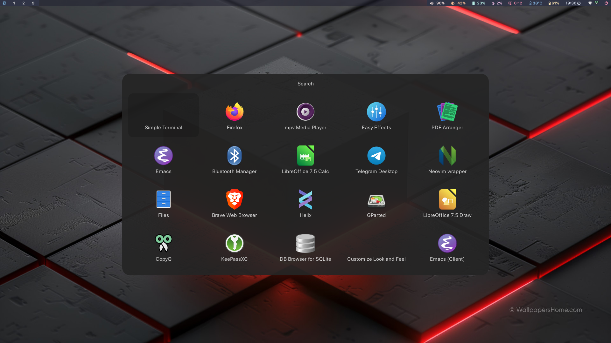

# Thinkpad P50 Flake + SWAY




## Folder structure

```
~/.dotfiles
.
├── apache
│   └── default.nix
├── configuration.nix
├── flake.lock
├── flake.nix
├── greetd
│   └── default.nix
├── hardware-configuration.nix
├── home
│   ├── dunst
│   ├── emacs
│   ├── gtk
│   ├── helix
│   ├── mpv
│   ├── neovim
│   ├── st
│   ├── sway
│   ├── kitty
│   ├── zsh
│   ├── tmux
│   ├── waybar
│   └── home.nix
├── README.md
└── screenshot-sway.jpg
```


## How to use this repo

1. Clone it.
1. Copy your own `hardware-configuration.nix` to this folder.
1. Rebuild the system with flake command : `sudo nixos-rebuild switch --flake .`
1. Wait till it finish.
1. See the generations `nix-env --list-generations --profile /nix/var/nix/profiles/system`

Now your system configuration is setup by flakes.

Every time you want to update, first go to this `.dotfiles` folder then update the system with this command:
1. `nix flake update`
1. `sudo nixos-rebuild switch --flake .`

## Tips

Now every time you want to edit the system config or add package into home-manager, just go to `~/.dotfiles` folder then edit the files.

> Never touch the `hardware-configuration.nix` files if you don't know what to do.

If you got some error message like **warning: Git tree '/home/ is dirty**, don't worry. It's because you have integrated git in this .dotfile folder. 

To solve this, perform `git status`, `git add .`, `git commit -am "message"`, then switch to new configuration.


Big thanks to : [LibrePhoenix](https://www.youtube.com/watch?v=ACybVzRvDhs) for creating the nixos flake video content for novice like me.


